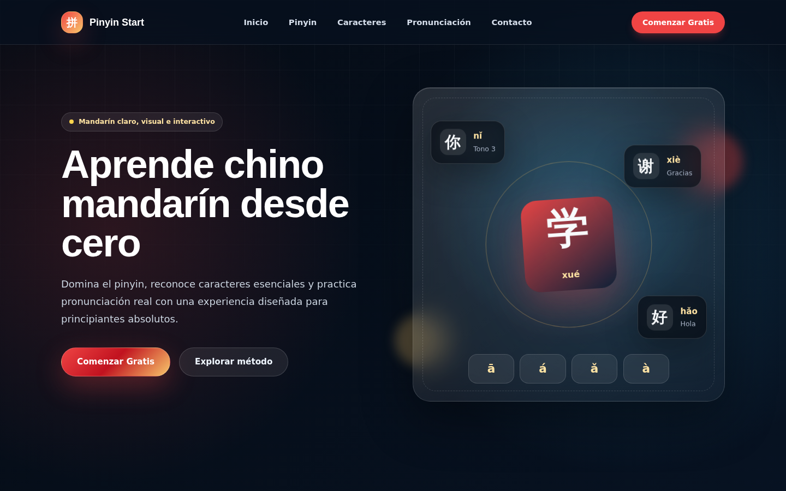
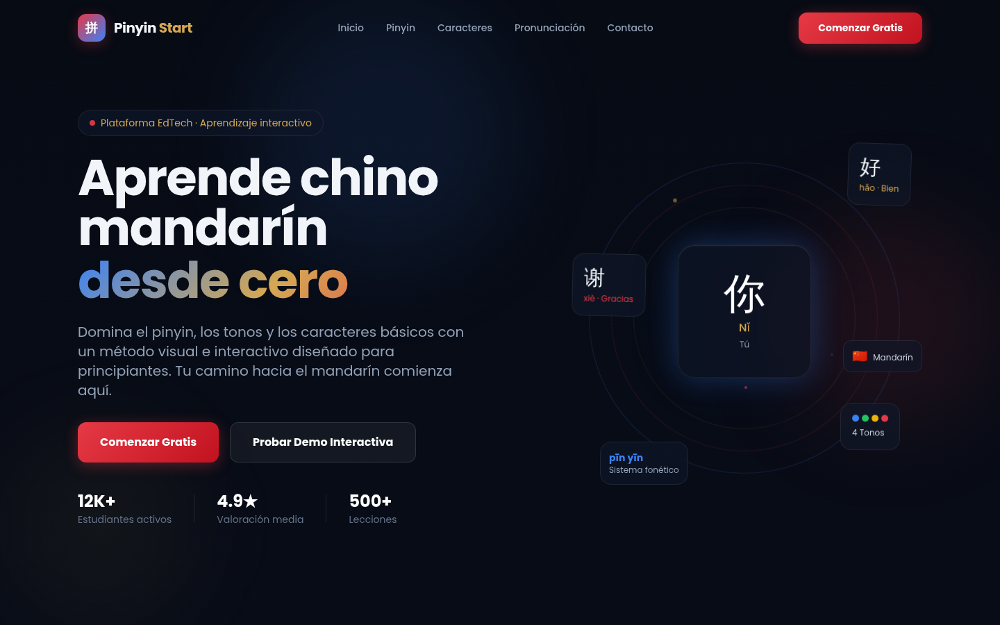

PFO2 — Diseño y Programación Web

Comparativa de landing pages generadas por dos agentes de IA distintos (Codex y Cursor) a partir de un mismo prompt, para la plataforma educativa ficticia **"Pinyin Start"** (enseñanza de chino mandarín nivel 1).

---

👤 Datos del estudiante

- Nombre y apellido: Mara Luz Skaarup
- Trabajo: PFO2 — Diseño y Programación Web
- Año: 2026

## 🔗 Link al deploy unificado

Deploy en Vercel:(https://pfo-2-frontend-iota.vercel.app/)

Ese enlace dirige a `portada.html`, que centraliza el acceso a las tres vistas:

1. **Prompt utilizado** (`prompt.html`)
2. **Agente 1 — Codex** (`landing1.html`)
3. **Agente 2 — Cursor** (`landing2.html`)

📝 Prompt exacto utilizado

El mismo prompt fue enviado de forma idéntica a ambos agentes de IA:

PROMPT

Actúa como un Diseñador UI/UX Senior, Especialista en Experiencia de Usuario Educativa (EdTech) y Desarrollador Front-End Senior. Eres experto en HTML5, CSS3, JavaScript Vanilla y Tailwind CSS. Tu objetivo es generar una landing page moderna, profesional, completamente funcional y visualmente impactante para una plataforma de aprendizaje de chino mandarín para principiantes llamada "Pinyin Start".

Contexto del Proyecto

Pinyin Start es una plataforma educativa diseñada para personas que desean aprender chino mandarín desde cero.

El sitio debe transmitir innovación, tecnología, aprendizaje interactivo y simplicidad.

La experiencia visual debe inspirarse en plataformas modernas como Duolingo, Notion, Stripe, Linear y Coursera, utilizando un diseño elegante, minimalista y altamente profesional.

Tecnologías Obligatorias

Utiliza exclusivamente:

* HTML5
* CSS3
* JavaScript Vanilla
* Tailwind CSS vía CDN

No utilices frameworks adicionales.

Todo debe funcionar simplemente abriendo los archivos en un navegador.

REGLA DE ORO

Debes generar el código 100% completo.

No debes escribir comentarios como:

"continúa aquí"
"agrega más contenido"
"código omitido"
"resto del código"

Todo debe estar completamente desarrollado.

Estilo Visual

Paleta

* Fondo principal oscuro elegante
* Tonos azul profundo
* Acentos rojo chino
* Acentos dorados sutiles
* Contrastes modernos

Diseño

* Glassmorphism
* Gradientes suaves
* Sombras modernas
* Animaciones delicadas
* Diseño responsive Mobile First
* Bordes redondeados
* Efectos hover profesionales

Tipografía

Utiliza Google Fonts modernas.

Preferentemente:

* Poppins
* Inter
* Plus Jakarta Sans

Estructura Obligatoria

1. Header

Debe incluir:

* Logo "Pinyin Start"
* Menú de navegación
* Inicio
* Pinyin
* Caracteres
* Pronunciación
* Contacto

Botón CTA:

"Comenzar Gratis"

Header fijo con efecto blur.

2. Hero Section

Título principal impactante:

"Aprende chino mandarín desde cero"

Subtítulo explicativo.

Botón CTA principal.

Botón secundario.

En el lado derecho crear una ilustración tecnológica utilizando únicamente HTML y CSS.

NO utilizar imágenes cuadradas simples.

Utilizar:

* Tarjetas flotantes
* Caracteres chinos
* Elementos visuales modernos
* Efectos glow

3. Sobre Nosotros

Explicar qué es Pinyin Start.

Destacar:

* Aprendizaje desde cero
* Método visual
* Pronunciación correcta
* Caracteres básicos
* Ejercicios prácticos

4. Características Principales

Diseñar un grid responsive de tarjetas.

Tarjetas:

   a. Pinyin
   b. Tonos
   c. Pronunciación
   d. Caracteres chinos
   e. Vocabulario básico
   f. Conversaciones cotidianas

Cada tarjeta debe tener:

* Ícono
* Título
* Descripción
* Efectos hover modernos

5. Sección Interactiva

Implementar con JavaScript Vanilla.

Widget de Pronunciación

Mostrar ejemplos:

* 你好
* 谢谢
* 再见

Al hacer clic en cada palabra debe mostrarse:

* Caracter
* Pinyin
* Traducción

mediante JavaScript.

Flashcards

Crear tarjetas interactivas que se giren al hacer clic.

Ejemplos:

Frente:
你好

Atrás:
Nǐ hǎo
Hola

Implementar animación de giro.

6. Testimonios

Mostrar tres estudiantes ficticios.

Cada tarjeta debe contener:

* Avatar circular
* Nombre
* Comentario
* Calificación visual de 5 estrellas

Diseño tipo Bento Grid moderno.

7. Formulario de Contacto

Campos:

* Nombre
* Correo electrónico
* Nivel actual
* Mensaje

Validaciones HTML5 obligatorias.

Diseño moderno en modo oscuro.

8. Footer

Incluir:

* Redes sociales
* Recursos
* Curso de Pinyin
* Curso de Caracteres
* Curso de Pronunciación

Además:

© Pinyin Start 2026

Requisitos Responsivos

Debe visualizarse correctamente en:

* Móviles
* Tablets
* Notebooks
* Monitores grandes

Calidad Visual Esperada

La landing debe parecer un producto real listo para producción.

Debe verse claramente superior a una landing académica básica.

Priorizar:

* Estética moderna
* Animaciones suaves
* Experiencia de usuario
* Legibilidad
* Profesionalismo

Formato de Entrega

No explicar el código.

No resumir.

Mostrar únicamente los bloques completos de código.

Agente 1 — Codex (`landing1.html`)

Agente 2 — Cursor (`landing2.html`)

Tecnologías

- HTML5, CSS3 y JavaScript vanilla
- Tailwind CSS (vía CDN, en `landing1.html` y `landing2.html`)
- Google Fonts: Inter, Plus Jakarta Sans
- Deploy: Vercel
